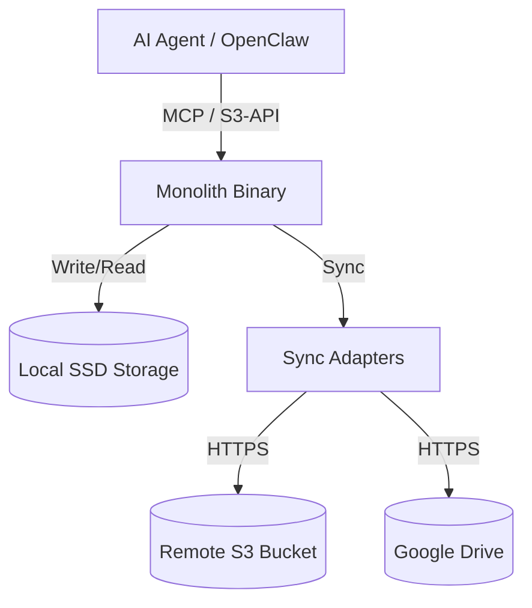

# Monolith Architecture

## System Overview
Monolith acts as a "Datastore Proxy." Agents interact with the Monolith Binary via MCP or S3-API, and Monolith manages the physical storage and remote synchronization.

## Components

### 1. The Frontend (Interface Layer)
- **MCP Server:** Tools for `put_object`, `get_object`, `list_keys`.
- **S3-Compatible API:** A lightweight HTTP server for standard S3 SDKs.

### 2. The Core (Storage Engine)
- Manages metadata (SQLite).
- Handles local file lifecycle.
- Implements locking mechanisms for multi-agent access.

### 3. The Backend (Sync Layer)
- Pluggable adapters.
- **Lazy Sync:** Immediate local write, eventual remote sync.
- **Conflict Resolution:** Strategy-based merging for multi-node setups.

## Deployment
- Single Go binary.
- Configured via `monolith.yaml`.
- Designed to run on Raspberry Pi 4/5 or local workstations.
